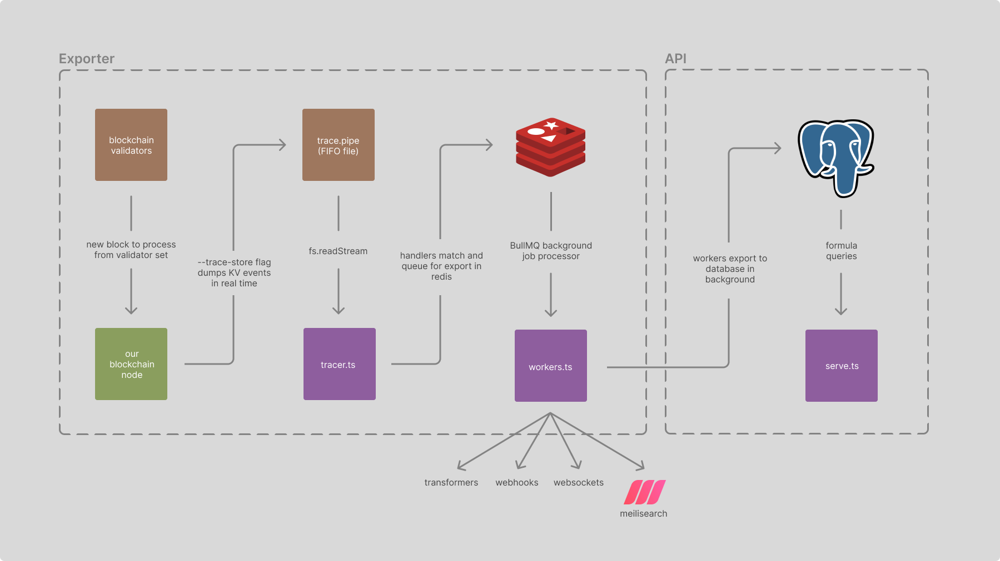

# onboarding

## why

blockchain nodes are primarily designed for consensus and TX processing, not
data querying

cannot create cross-contract queries, aggregations, reverse lookup contracts by
state values, etc.

wanted to do something as simple as indexing DAO's token balances over time to
track inflows/outflows (after DAO is created), could not do this because token
contract doesn't emit new balance events during transfers, just amount
transferred

### TX vs state

TX:

- must be live during events to build history
- depends on contracts implementing specific events that emit the necessary data
- depends on node with TX history to reindex or index new information
- can only easily detect messages sent by wallets, hard to extract
  contract-to-contract effects

state:

- all state is relatively small compared to blockchain storage needs
- never need to reindex
- can index others' contracts
- far more useful and intuitive in multi-contract environments

## architecture

- cosmos chain nodes have a `--trace-store` flag that dumps read/write/delete
  events to its KV store to a file
- `mkfifo` command creates a file-based FIFO (named pipe) that looks like a file
  on the filesystem, which makes cross-process communication (with blocking)
  possible
- tracer process runs next to node, buffers reads from FIFO file that node is
  writing to, decodes/matches events, and queues in redis for export and to
  prevent blocking node from ingesting blocks
- workers process reads from redis queue, transforms data, and exports to
  database
  - transformed data is also potentially sent to various subsystems running in
    workers: transformers, webhooks/websockets, meilisearch instance, etc.
- API process runs separately, queries database, and serves API endpoints
  auto-generated from formulas and aggregators

### DB key encoding

- no deterministic generic decoding of chain KV store keys, must know exact
  concatenation of key parts because it uses prefix-length encoding
- state keys are stored in DB as strings that contain comma-separated lists of
  uint8 byte values, ensuring any key format is supported
  - trigram index speeds up partial (mostly prefix) matches using LIKE
  - can deterministically encode a known key into this format, so exact matches
    are easy, and prefix matches (i.e. with namespaced maps) are also easy
- in hindsight could have used heuristics (assume sub-ASCII two-byte pairs are
  lengths) to decode keys into utf-8 strings without knowing the exact format,
  but some old contracts / CosmWasm versions used legacy key encoding
  mechanisms, and in the Cosmos you never know what fork of what module a chain
  is running (everyone does things a little differently)
- can rely on transformers for decoding known keys into utf-8 strings for easy
  querying and searching when necessary. keep the default system highly
  generic/efficient

### formulas

- core unit of server logic, highly modular, "dumb" functions
- define the relationship between the arbitrary "current" state and the output
- environment context wrapper provides generic query functions bounded for
  relevant time window (current, past block, range of blocks, etc.)
  - separation of concerns between formula and database/environment:
    - automatic time window management
    - easier caching
    - easier testing
    - trustless formula execution (deploy as a service others can build on)

#### aggregators

- use formula modularity to customize further
- meta-level over formulas, combine formulas, specify blocks, times, ranges,
  etc.

### transformers

- declarative syntax to match and transform data
- pre-process/select specific data to modify shape, aggregate in some way,
  support reverse lookups, etc.
  - turn maps into lists
  - store boolean that is quickly indexed by name
  - maintain single incrementally-built list of all contracts with balances
    instead of querying the whole table each time
- store in separate smaller table for efficient queries

### webhooks/websockets

- declarative syntax to match data as it comes in and send it to arbitrary
  endpoints / websockets

### meilisearch

- declarative syntax to compute and store formula outputs in a search instance
- detect changes to formulas and update the search instance automatically

## future changes

- automatically execute contract WASMs manually import contract with wrapped
  API, replace state access with DB queries
